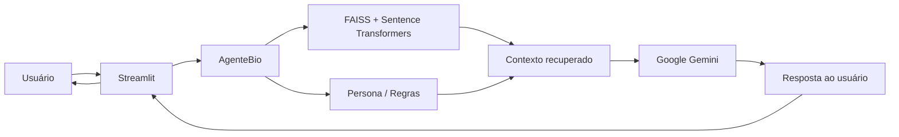

# Assistente Virtual Financeiro

Agente conversacional voltado para **educação e orientação financeira**, desenvolvido em Python e integrado ao Google Gemini. O projeto utiliza uma arquitetura baseada em RAG (Retrieval-Augmented Generation), combinando busca vetorial com geração de respostas por LLM.

O agente utiliza uma base de conhecimento financeira hospedada no Hugging Face, gera embeddings utilizando Sentence Transformers e realiza buscas semânticas através do FAISS antes de enviar o contexto recuperado ao Gemini.

O projeto também utiliza o Langfuse para observabilidade, permitindo acompanhar as operações realizadas pelo agente, incluindo buscas vetoriais e chamadas ao modelo de linguagem.

---

## 1. Sobre o agente

### Breve resumo

O Assistente Virtual Financeiro foi desenvolvido para responder perguntas relacionadas à educação financeira de forma contextualizada e responsável.

O fluxo principal do agente é:



Antes de gerar uma resposta, o agente realiza uma busca semântica na base de dados. Os documentos mais relevantes são incorporados ao contexto enviado ao modelo de linguagem.

A implementação utiliza duas fontes de dados do Hugging Face:

* `sujet-ai/Sujet-Finance-Instruct-177k`
* `snorkelai/agent-finance-reasoning`

O projeto carrega uma amostra de até 1.000 registros de cada conjunto de dados para formar a base utilizada pelo mecanismo de busca vetorial.

A implementação da base vetorial está concentrada no arquivo `database.py`, utilizando `SentenceTransformer` para geração dos embeddings e `faiss.IndexFlatL2` para busca por similaridade.

---

## 2. Principais características

* Interface conversacional desenvolvida com Streamlit.
* Integração com Google Gemini.
* Arquitetura RAG.
* Busca semântica utilizando embeddings.
* FAISS como mecanismo de busca vetorial.
* Sentence Transformers para geração de embeddings.
* Base de conhecimento financeira proveniente do Hugging Face.
* Persona específica para o agente financeiro.
* Histórico de conversação enviado ao modelo.
* Observabilidade com Langfuse.
* Tratamento de erros da API do Gemini.
* Execução local utilizando CPU.
* Cache do Streamlit para evitar a reconstrução desnecessária da base vetorial.

---

## 3. Stack de desenvolvimento

### Linguagem

* Python 3.12

O projeto foi desenvolvido e testado utilizando Python 3.12.

### Interface

* Streamlit

### Inteligência artificial

* Google Gemini
* Google GenAI SDK
* Sentence Transformers
* Hugging Face Datasets

### Busca vetorial

* FAISS CPU
* NumPy

### Observabilidade

* Langfuse 4.15.2

### Outras bibliotecas

* SciPy
* Scikit-learn
* python-dotenv
* Pandas
* PyArrow

---

## 4. Requisitos

Para executar o projeto, é necessário possuir:

* Python 3.12
* pip
* acesso à internet
* uma chave de API do Google Gemini
* credenciais do Langfuse, caso a observabilidade seja utilizada

Não é necessário possuir uma GPU dedicada.

O projeto pode utilizar PyTorch em modo CPU:

```text
torch 2.14.0+cpu
```

Também é recomendado utilizar:

```text
faiss-cpu
```

em vez de uma versão do FAISS destinada a ambientes com GPU.

---

## 5. Estrutura do projeto

Uma estrutura simplificada do projeto é:

```text
desafio_DIO_assistenteVirtual/
|
├── logs
│     ├── historico_prompts.log
│     ├── log_qualidade_respostas.txt
│     ├── prompt_log_respostas.txt
│
├── src/
│   ├── agente.py
│   ├── app.py
│   ├── database.py
│   ├── config.py
│   └── persona.py
│
├── .env
├── .gitignore
└── README.md
```

### `app.py`

Responsável pela interface do aplicativo utilizando Streamlit.

O arquivo mantém o histórico da conversa e encaminha as mensagens do usuário para o `AgenteBio`.

### `agente.py`

Contém a implementação principal do agente.

Suas responsabilidades incluem:

* receber a mensagem do usuário;
* recuperar contexto através do FAISS;
* construir a instrução de sistema;
* montar o histórico da conversa;
* enviar a solicitação ao Gemini;
* tratar erros;
* registrar observações no Langfuse.

### `database.py`

Responsável pela construção e consulta da base vetorial.

O arquivo:

1. carrega os datasets do Hugging Face;
2. transforma os registros em documentos;
3. gera embeddings;
4. cria o índice FAISS;
5. realiza buscas semânticas.

### `persona.py`

Define o comportamento e as regras do agente.

A persona contém orientações sobre:

* comportamento do assistente;
* educação financeira;
* segurança;
* limites de atuação;
* tratamento de perguntas fora do domínio financeiro.

---

# 6. Configuração do ambiente

## 6.1 Criar o ambiente virtual

Na raiz do projeto:

```bash
python3.12 -m venv .venv
```

Ative o ambiente virtual:

### Linux / Fedora

```bash
source .venv/bin/activate
```

### Windows

```powershell
.venv\Scripts\activate
```

Depois, confirme a versão:

```bash
python --version
```

O resultado esperado é semelhante a:

```text
Python 3.12.x
```

---

# 7. Instalação das dependências

Com o ambiente virtual ativado:

```bash
python -m pip install --upgrade pip
```

Para instalar o PyTorch em modo CPU:

```bash
python -m pip install torch==2.14.0 --index-url https://download.pytorch.org/whl/cpu
```

Instale também o torchvision correspondente:

```bash
python -m pip install torchvision==0.29.0 --index-url https://download.pytorch.org/whl/cpu
```

As demais dependências podem ser instaladas com:

```bash
python -m pip install \
    streamlit \
    google-genai \
    python-dotenv \
    langfuse \
    datasets \
    sentence-transformers \
    faiss-cpu \
    numpy \
    scipy \
    scikit-learn
```

Após a instalação, verifique o ambiente:

```bash
python -m pip check
```

O resultado esperado é:

```text
No broken requirements found.
```

---

# 8. Configuração das chaves de API

As credenciais não devem ser armazenadas diretamente no código-fonte.

O projeto deve utilizar um arquivo `.env` para armazenar as chaves utilizadas localmente.

## 8.1 Criando o `.env`

Na raiz do projeto:

```bash
touch .env
```

Adicione as variáveis necessárias:

```env
GEMINI_API_KEY=sua_chave_do_gemini

LANGFUSE_PUBLIC_KEY=sua_chave_publica
LANGFUSE_SECRET_KEY=sua_chave_secreta
LANGFUSE_BASE_URL=https://cloud.langfuse.com
```

Substitua os valores pelos dados reais das suas contas.

O arquivo `.env` **não deve ser enviado para o GitHub ou outro repositório público**.

---

# 9. Carregando as variáveis de ambiente

O projeto utiliza `python-dotenv`.

Exemplo:

```python
from dotenv import load_dotenv
import os

load_dotenv()

gemini_api_key = os.getenv("GEMINI_API_KEY")
langfuse_public_key = os.getenv("LANGFUSE_PUBLIC_KEY")
langfuse_secret_key = os.getenv("LANGFUSE_SECRET_KEY")
```

Uma alternativa é manter as configurações centralizadas no `config.py`, como utilizado pelo projeto.

Exemplo:

```python
import os
from dotenv import load_dotenv

load_dotenv()

GEMINI_API_KEY = os.getenv("GEMINI_API_KEY")
```

---

# 10. Configurando o `.gitignore`

Crie um arquivo `.gitignore` na raiz do projeto:

```gitignore
# Ambiente virtual
.venv/
venv/
env/

# Variáveis de ambiente e credenciais
.env
.env.*
!.env.example

# Arquivos Python
__pycache__/
*.py[cod]
*$py.class

# Cache de ferramentas
.pytest_cache/
.mypy_cache/
.ruff_cache/

# Cache do Streamlit
.streamlit/

# Modelos e dados baixados localmente
.cache/
huggingface/
models/

# Arquivos do sistema operacional
.DS_Store
Thumbs.db

# IDEs
.vscode/
.idea/

# Logs
*.log
```

A regra mais importante para proteger as credenciais é:

```gitignore
.env
```

Dessa forma, o arquivo que contém as chaves de API não será incluído no commit.

---

# 11. Criando um `.env.example`

Para documentar quais variáveis são necessárias sem expor as credenciais reais, crie um arquivo:

```text
.env.example
```

Conteúdo:

```env
GEMINI_API_KEY=

LANGFUSE_PUBLIC_KEY=
LANGFUSE_SECRET_KEY=
LANGFUSE_BASE_URL=https://cloud.langfuse.com
```

Esse arquivo pode ser versionado no Git.

O fluxo recomendado é:

```text
.env.example
     |
     | copiar
     v
   .env
     |
     | preencher
     v
Credenciais reais
```

Por exemplo:

```bash
cp .env.example .env
```

Depois, edite o `.env` e informe suas chaves.

---

# 12. Conexão com o Google Gemini

O projeto utiliza o pacote `google-genai`.

Uma conexão básica pode ser feita da seguinte maneira:

```python
from google import genai
from config import GEMINI_API_KEY

client = genai.Client(
    api_key=GEMINI_API_KEY
)
```

Uma chamada simples ao modelo:

```python
from google.genai import types

config = types.GenerateContentConfig(
    system_instruction="Você é um assistente financeiro educacional.",
    temperature=0.1,
)

response = client.models.generate_content(
    model="gemini-3.5-flash-lite",
    contents="Explique o que é uma reserva de emergência.",
    config=config,
)

print(response.text)
```

No agente, a chamada é encapsulada pelo método responsável pela geração da resposta:

```python
response = self.client.models.generate_content(
    model=self.model_name,
    contents=messages,
    config=config
)

return response.text
```

O histórico da conversa também é convertido para o formato esperado pelo Gemini antes da chamada.

---

# 13. Conexão com o Langfuse

O projeto utiliza o Langfuse para observabilidade.

Na versão 4.x do SDK, o cliente pode ser obtido através de:

```python
from langfuse import get_client

langfuse = get_client()
```

O Langfuse utiliza as variáveis de ambiente configuradas no `.env`.

Exemplo:

```env
LANGFUSE_PUBLIC_KEY=sua_chave_publica
LANGFUSE_SECRET_KEY=sua_chave_secreta
LANGFUSE_BASE_URL=https://cloud.langfuse.com
```

## 13.1 Instrumentando uma função

O decorator `observe` pode ser utilizado para registrar uma operação:

```python
from langfuse import observe

@observe(name="gemini_generation")
def gerar_resposta():
    ...
```

No projeto, existem observações para diferentes etapas do processamento:

```python
@observe(name="processar_mensagem_bio")
def processar_mensagem(...):
    ...
```

Busca vetorial:

```python
@observe(name="faiss_search")
def _buscar_contexto_faiss(...):
    ...
```

Geração da resposta:

```python
@observe(name="gemini_generation")
def _gerar_resposta_llm(...):
    ...
```

Isso permite separar no Langfuse as principais etapas da execução do agente.

---

# 14. Atributos de observabilidade

Para associar informações ao contexto das observações, o Langfuse 4.x utiliza `propagate_attributes`.

Exemplo:

```python
from langfuse import propagate_attributes

with propagate_attributes(
    user_id="usuario_demo",
    tags=["financeiro", "faiss_rag"],
):
    resposta = gerar_resposta()
```

Essa abordagem substitui a API antiga baseada em:

```python
langfuse_context
```

que não faz parte da API utilizada pelo Langfuse 4.x.

---

# 15. Finalizando o processamento do Langfuse

Ao final da execução da aplicação, o cliente pode ser sincronizado utilizando:

```python
langfuse.flush()
```

Exemplo:

```python
from langfuse import get_client

langfuse = get_client()

# execução da aplicação

langfuse.flush()
```

---

# 16. Funcionamento do RAG

O projeto utiliza RAG para fornecer contexto adicional ao modelo.

O processo pode ser resumido da seguinte forma:

```text
Pergunta do usuário
        |
        v
Sentence Transformer
        |
        v
Embedding da pergunta
        |
        v
FAISS
        |
        v
Documentos mais relevantes
        |
        v
Contexto financeiro
        |
        v
System Instruction
        |
        v
Gemini
        |
        v
Resposta
```

O modelo utilizado para os embeddings é:

```text
sentence-transformers/all-MiniLM-L6-v2
```

A busca atualmente recupera os dois documentos mais próximos:

```python
distancias, indices = indice.search(
    query_embedding,
    top_k
)
```

---

# 17. Exemplos de prompts

Os prompts abaixo podem ser utilizados para testar o agente.

## 17.1 Educação financeira

```text
O que é uma reserva de emergência e por que ela é importante?
```

## 17.2 Orçamento pessoal

```text
Como posso organizar meu orçamento mensal para controlar melhor meus gastos?
```

## 17.3 Investimentos

```text
Qual é a diferença entre renda fixa e renda variável?
```

## 17.4 Conceitos financeiros

```text
Explique de forma simples o que significa inflação.
```

## 17.5 Planejamento financeiro

```text
Quais são os principais passos para começar um planejamento financeiro pessoal?
```

## 17.6 Comparação conceitual

```text
Quais são as diferenças entre poupança e outros investimentos de renda fixa?
```

## 17.7 Pergunta fora do domínio

Também é importante testar o comportamento do agente diante de perguntas que não pertencem ao domínio financeiro:

```text
Quem ganhou a Copa do Mundo de 2002?
```

Esse tipo de teste permite verificar se as regras definidas na persona estão sendo respeitadas.

---

# 18. Executando o projeto

Com o ambiente virtual ativado e o `.env` configurado:

```bash
streamlit run src/app.py
```

O Streamlit deverá iniciar a aplicação localmente e disponibilizar a interface no navegador.

---

# 19. Primeiro carregamento da base

Na primeira execução, o projeto pode levar algum tempo para iniciar.

Isso ocorre porque o `database.py` precisa:

1. acessar os datasets do Hugging Face;
2. carregar os registros;
3. carregar o modelo `all-MiniLM-L6-v2`;
4. gerar os embeddings;
5. construir o índice FAISS.

Após a inicialização, o Streamlit utiliza cache para evitar que esse processo seja repetido desnecessariamente durante a execução da aplicação.

---

# 20. Testando as dependências

Antes de executar a aplicação completa, é possível verificar individualmente as principais dependências.

## PyTorch

```bash
python -c "import torch; print(torch.__version__); print(torch.cuda.is_available())"
```

Em uma instalação CPU, o resultado esperado é semelhante a:

```text
2.14.0+cpu
False
```

## Torchvision

```bash
python -c "import torchvision; print(torchvision.__version__)"
```

## Sentence Transformers

```bash
python -c "from sentence_transformers import SentenceTransformer; print('Sentence Transformers OK')"
```

## FAISS

```bash
python -c "import faiss; print('FAISS OK')"
```

## Langfuse

```bash
python -c "from langfuse import get_client; print('Langfuse OK')"
```

## Gemini

```bash
python -c "from google import genai; print('Google GenAI OK')"
```

---

# 21. Segurança

As chaves utilizadas pelo projeto são credenciais privadas e não devem ser incluídas no código-fonte.

Não faça:

```python
GEMINI_API_KEY = "AIza..."
```

Nem:

```python
LANGFUSE_SECRET_KEY = "sk-lf-..."
```

Prefira:

```python
import os

GEMINI_API_KEY = os.getenv("GEMINI_API_KEY")
```

e mantenha os valores reais no `.env`.

Também não devem ser versionados:

* `.env`;
* tokens;
* chaves de API;
* credenciais do Langfuse;
* arquivos contendo informações sensíveis;
* dumps de dados privados.

Caso uma chave seja acidentalmente publicada em um repositório, ela deve ser revogada e substituída imediatamente.

---

# 22. Comandos úteis

Ativar o ambiente virtual:

```bash
source .venv/bin/activate
```

Verificar Python:

```bash
python --version
```

Verificar pip:

```bash
python -m pip --version
```

Verificar dependências:

```bash
python -m pip check
```

Listar pacotes:

```bash
python -m pip list
```

Atualizar uma dependência:

```bash
python -m pip install --upgrade nome-do-pacote
```

Executar o Streamlit:

```bash
streamlit run src/app.py
```

---

# 23. Limitações

O agente deve ser utilizado como ferramenta de **educação e orientação financeira**, e não como substituto de um profissional especializado.

As respostas de um modelo de linguagem podem conter erros. Informações financeiras devem ser verificadas antes de qualquer tomada de decisão.

A qualidade das respostas também depende da qualidade e da cobertura da base de conhecimento recuperada pelo mecanismo RAG.

---

# 24. Resumo da arquitetura

| Componente            | Tecnologia            | Função                        |
| --------------------- | --------------------- | ----------------------------- |
| Interface             | Streamlit             | Interface conversacional      |
| Linguagem             | Python 3.12           | Desenvolvimento               |
| LLM                   | Google Gemini         | Geração das respostas         |
| SDK Gemini            | `google-genai`        | Comunicação com Gemini        |
| Embeddings            | Sentence Transformers | Representação vetorial        |
| Modelo de embedding   | `all-MiniLM-L6-v2`    | Geração dos embeddings        |
| Busca vetorial        | FAISS CPU             | Recuperação de contexto       |
| Dados                 | Hugging Face Datasets | Base de conhecimento          |
| Observabilidade       | Langfuse 4.x          | Tracing e monitoramento       |
| Variáveis de ambiente | python-dotenv         | Gerenciamento das credenciais |
| Computação ML         | PyTorch CPU           | Backend dos embeddings        |

---

# 25. Licença

Adicione aqui a licença escolhida para o projeto caso ele seja publicado em um repositório público.

Exemplo:

```text
MIT License
```

---

# 26. Autor

Projeto desenvolvido como parte do desafio de desenvolvimento de um assistente virtual utilizando inteligência artificial generativa, RAG e observabilidade.

---
