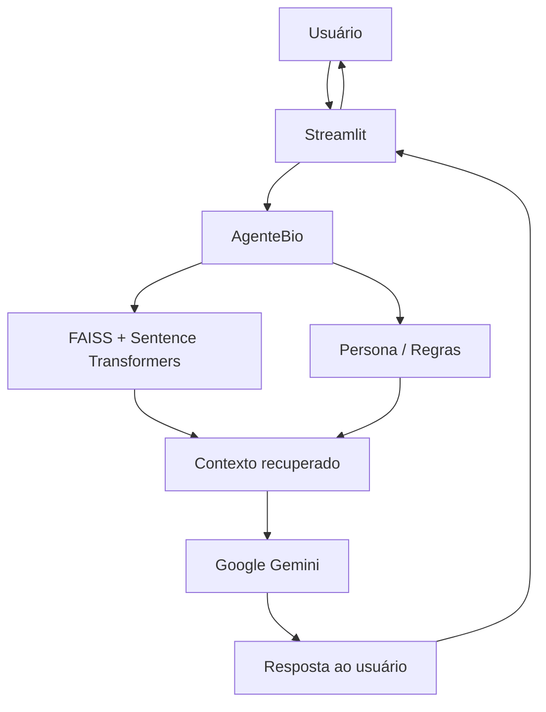

# Documentação do Agente

## Caso de Uso

### Problema
> Qual problema financeiro seu agente resolve?

O agente tem um amplo conhecimento, que vai desde investimentos até problemas do cotidiano.

### Solução
> Como o agente resolve esse problema de forma proativa?

O agente acessa datasets dos repositórios Hugging Face e monta sua base de conhecimento, e com a ajuda de embeddings e o FAISS, contextualiza a dúvida para que se possa ter uma resposta sem alucinações.

### Público-Alvo
> Quem vai usar esse agente?

Qualquer pessoa que precise tirar dúvidas sobre finanças. 

## Persona e Tom de Voz

### Nome do Agente
BIO

### Personalidade
> Como o agente se comporta? (ex: consultivo, direto, educativo)

Um profissional financeiro experiente, acolhedor e contemporâneo, que dá respostas diretas e de fácil assimilação.

### Tom de Comunicação

Tem um tom contemporâneo, que utiliza linguagem que mistura o formal com o informal, sempre utilizando analogias para facilitar o entendimento do usuário quando for necessário a explicação de jargões técnicos.

### Exemplos de Linguagem

- Saudação: ex: "Olá! Sou o BIO, expert em finanças, como posso te ajudar hoje?"
- Erro/Limitação: ex: "Desculpe, não tenho essa informação no momento"

---

## Arquitetura

### Diagrama

### Componentes

| Componente | Descrição |
|------------|-----------|
| Interface | Chatbot em Streamlit|
| LLM | Gemini via API (gemini-3.5-flash-lite) |
| Base de Conhecimento | API Hugging Face |
| Validação | temperatura = 0.1 / guardrails (responder somente com base nos dados) |

---

## Segurança e Anti-Alucinação

### Estratégias Adotadas

- [X] Agente só responde com base nos dados fornecidos
- [X] Respostas incluem fonte da informação
- [X] Quando não sabe, admite
- [X] Não faz recomendações de investimento sem perfil do cliente
- [X] Ao realizar recomendações, caso possua o perfil do cliente, recomenda consulta a um profissional da área
- [X] Não dar respostas as quais ele não é especialista (mecânica, saúde, etc...)

### Limitações Declaradas
> O que o agente NÃO faz?

* Por utilizar dois datasets do Hugging Face, o agente não consegue acessar informações referentes ao seu perfil financeiro, devendo o usuário informar.
* Não acessa informações externas a base de dados.